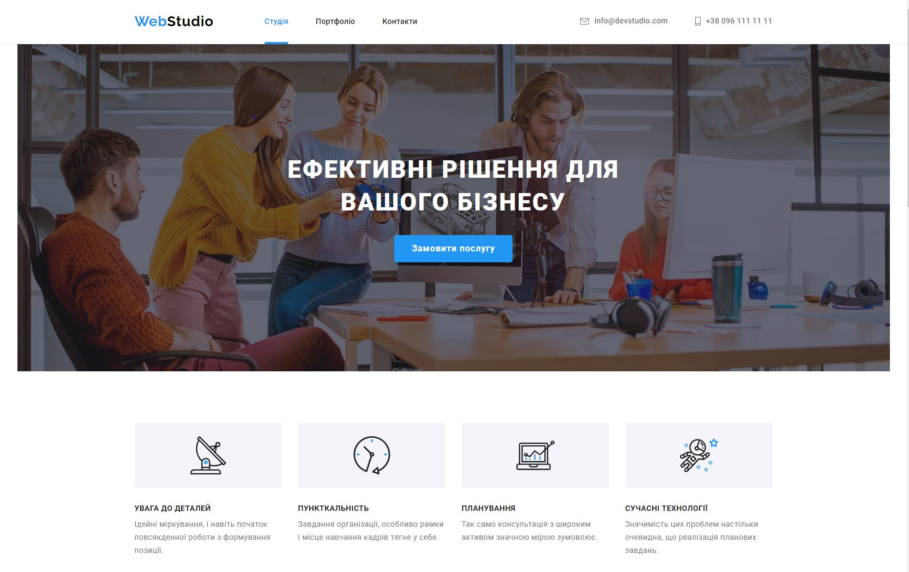

Замовник та Технології:

- Тренувальний макет для реалізації двох сторінкового сайту фотостудії.

- Використані технології: html, SASS, JS.

Використані Практики та Засоби:

- Семантична розмітка для покращення доступності та SEO.

- Методологія БЕМ для структурування та організації коду.

- Використання ARIA для покращення доступності веб-додатка.

- Адаптивний дизайн для оптимального відображення на різних пристроях.

- Респонсивні зображення.

- Стратегія Mobile First.

Реалізовані Функціональності:

- Favicon.

- Модальне вікно.

- Мобільне меню.

- Галерея з фільтрацією фото по категоріях.

- Плавний скрол до розділів з використанням меню навігації.

